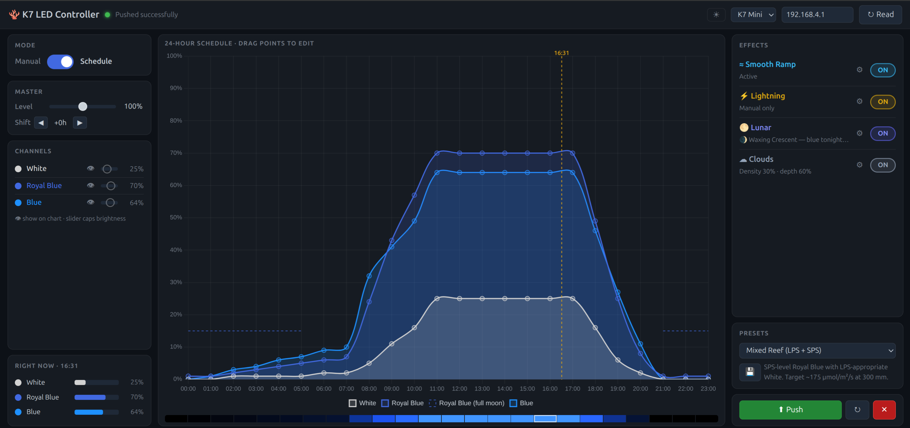

# K7 LED Controller

An unofficial web-based controller for **Noo-Psyche K7 Mini** and **K7 Pro** LED aquarium lamps.

<div align="center">


<a href="https://ko-fi.com/bitbarista" target="_blank"></a>

</div>

> This is an independent, community-developed project. It is not affiliated with or endorsed by Noo-Psyche.



## Features

- Read the current schedule and mode directly from the lamp
- Edit the 24-hour lighting schedule on an interactive drag-and-drop chart
- Additive colour preview strip showing the blended light output for each hour
- Built-in preset library for Fish Only, LPS Reef, SPS Reef, Mixed Reef, Soft Mixed Reef, Acclimation Mixed, LPS Low Energy, and Shallow SPS with dark overnight periods, practical coral photoperiods, and short dusk tails
- Master brightness slider and per-channel intensity sliders (absolute output ceiling per channel)
- Per-channel visibility toggles — hidden channels are zeroed when pushing to the device
- Day-shift control to slide the entire schedule forward or back (e.g. peak at 18:00 instead of midday)
- Save and reload your own named profiles (stored on the controller, persists across sessions)
- Manual mode with live preview
- **Smooth Ramp** — sends interpolated brightness values about every 10 seconds so transitions are smooth rather than stepped
- **Feed mode** — timed white brightness boost for feeding; adjustable intensity (1–100 %) and duration (1–60 min); also triggered by a quick press of the BOOT button on the board
- **Maintenance mode** — timed balanced inspection light for tank work, with adjustable profile intensity (1–100 %) and duration (1–180 min)
- **Lunar** — varies the royal blue channel over the 29.5-day synodic cycle, with either a fixed nightly window or a moonrise/moonset-shifted window anchored to full-moon times, plus optional night clamping and schedule-aware cutoff
- **Siesta** — optional midday dimming window for a coral rest/algae-control break; requires Smooth Ramp
- **Acclimation** — start the whole schedule dimmer, then recover gradually over a chosen number of days
- **Seasonal Shift** — move the whole photoperiod earlier and later across the year without changing day length
- **Effective Today** chart view, firmware-backed Right Now output bars, and schedule-aware checks so you can see the real computed output and catch odd combinations before they surprise you
- Backup export/import and persistent userdata storage so profiles and settings survive normal firmware and UI flashes
- Supports K7 Mini (3 channels) and K7 Pro (6 channels)

---

## Hardware

An ESP32-S3 board sits between your lamp and your devices, creating its own WiFi network. No PC required — the controller runs 24/7 and is always accessible from any phone or browser.

Two boards are supported:

| Board | Flash | Notes |
|-------|-------|-------|
| **ESP32-S3 SuperMini** | 4 MB | Compact and inexpensive. Widely available from AliExpress and similar. |
| **Seeed XIAO ESP32-S3** | 8 MB | More flash and PSRAM. Available from Seeed Studio, Mouser, or similar. The standard (non-Sense) variant works fine. |

Either board draws ~80 mA and can run from any USB phone charger.

---

## Documentation

Full setup and usage guide: **[bitbarista.github.io/k7-led-controller/guide.html](https://bitbarista.github.io/k7-led-controller/guide.html)**

## Support

K7 LED Controller is a spare-time open source project. If it has helped with your reef lighting setup, you can support continued development and testing.

<div align="center">

<a href="https://ko-fi.com/bitbarista" target="_blank"></a>

</div>

---

## Flashing

Visit **[bitbarista.github.io/k7-led-controller/flash.html](https://bitbarista.github.io/k7-led-controller/flash.html)**, connect your board via USB, and click **Install** next to your board type. Works in Chrome, Edge, and Opera — no software required.

If the device is not detected, hold the **BOOT** button while pressing **RST**, then click Install again.

---

## First-time WiFi setup

After flashing, the device starts a setup portal:

1. Connect to the **K7-Setup-XXXXXX** WiFi network (open, no password — the suffix is unique to your board)
2. Browse to **http://192.168.5.1** — the device scans for nearby K7 lamps automatically
3. Select your lamp from the list and tap **Connect & Save**
4. The device reboots. Connect to your **lamp's WiFi network** (K7-XXXXXX)
5. Browse to **http://k7controller.local** — the controller loads and reads the lamp. If mDNS doesn't resolve, use the fixed IP **http://192.168.4.200** instead.

> To reset to setup mode (e.g. to change lamps), hold the BOOT button on the board while powering on for 3 seconds.

> If your lamp is not found, make sure it is powered on. You can also enter the SSID manually.

---

## Network architecture

```
Your phone/browser ── K7 lamp AP (192.168.4.x) ── [ESP32-S3 @ 192.168.4.200] ── K7 lamp (192.168.4.1)
```

All devices connect to the lamp's own WiFi network. The ESP32-S3 runs in STA-only mode — no separate controller AP. Your home network is never involved.

The controller uses a **static IP of 192.168.4.200** so the address never changes after a WiFi reconnect. Bookmark `http://192.168.4.200` as a reliable fallback if `http://k7controller.local` is not resolving.

---

## Notes

- Profiles and settings are saved to flash and survive power cycles
- Smooth ramp, lunar cycle, feed mode, maintenance mode, and other schedule modifiers run entirely on the device — no browser needed once configured
- Normal firmware updates and LittleFS web UI flashes no longer erase saved profiles and config; only a full erase/factory reset clears them
- After updating firmware, reselect and push a built-in preset once if you want the controller to replace an older saved schedule with the latest preset definition
- **Applying a change takes approximately 1 second to take effect on the lamp.** This is normal — each change requires a full TCP round-trip to the lamp (connect, send schedule + brightness, wait for acknowledgement, disconnect). Rapid successive changes are batched: only the latest value is sent. This is a constraint of the K7 lamp's TCP protocol, not a bug in the controller.

---

## Device support

| Device  | Channels |
|---------|----------|
| K7 Mini | White, Royal Blue, Blue |
| K7 Pro  | UV, Royal Blue, Blue, White, Warm White, Red |

## Protocol

The lamp communicates over TCP on port 8266 using a simple binary framing protocol (`AA A5 [CMD] [data] BB`). The full implementation is in `arduino/src/K7Lamp.cpp`.

## Building from source

Requires [PlatformIO](https://platformio.org/).

```bash
cd arduino
pio run -e supermini    # ESP32-S3 SuperMini (4 MB)
pio run -e xiao         # Seeed XIAO ESP32-S3 (8 MB)
```

## Licence

[MIT](LICENSE)
